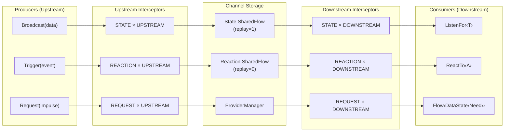
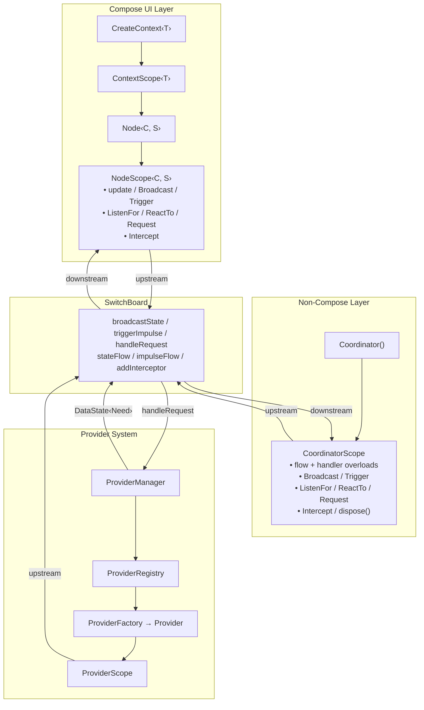
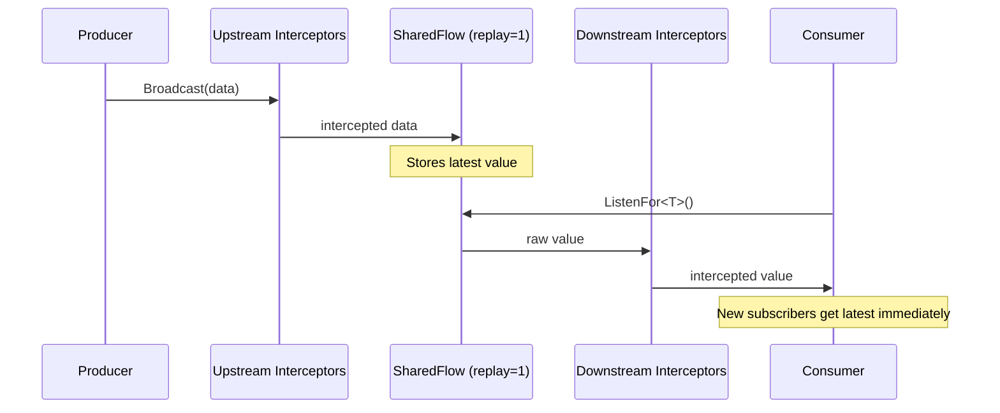
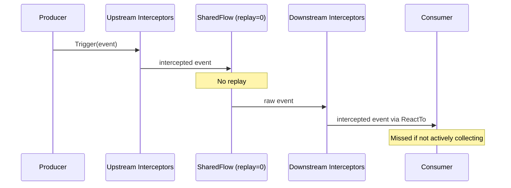
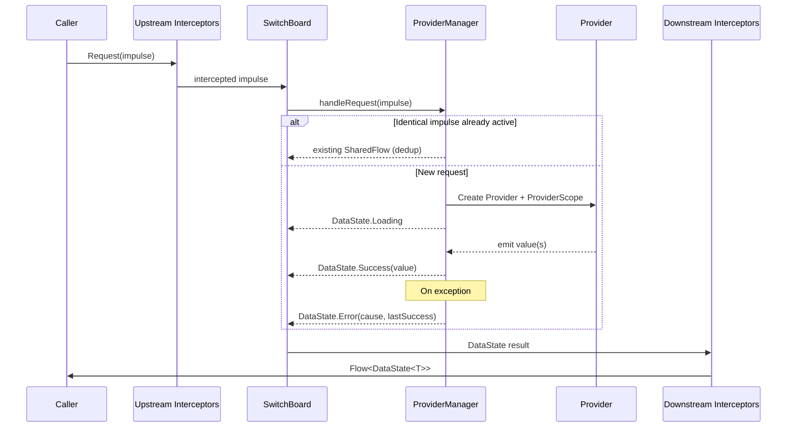
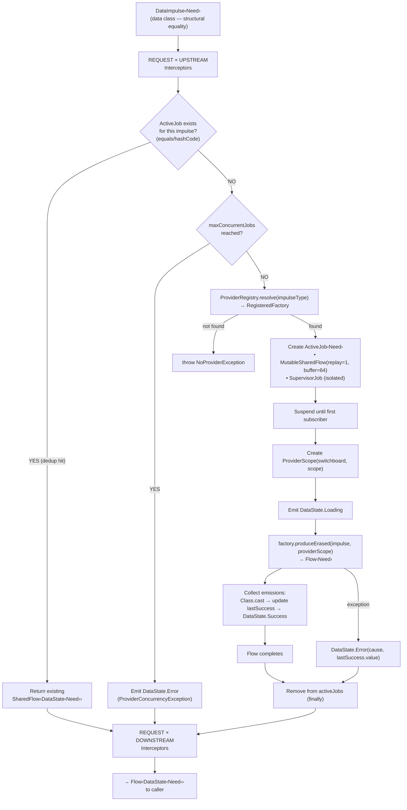
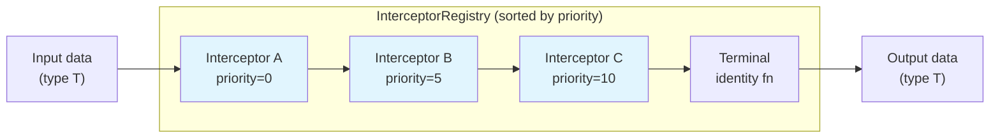

# Synapse Arch


**Architecture framework for Kotlin/Compose that eliminates the coordination problem.**

Every component in a Synapse application is an isolated state machine with typed inputs and outputs. Components never reference each other — they communicate exclusively through a central **SwitchBoard** that routes **state**, **reactions**, and **data requests** with a composable interceptor pipeline at every stage. The coupling between any two components is zero beyond the impulse types they share.

This gives you a property most architectures can't: **compositional correctness**. If Component A works through the SwitchBoard and Component B works through the SwitchBoard, then A + B works — because the bus is real, never mocked, and the type system enforces the contract.

There are no ViewModels. **Compose** screens use the `Node`/`CreateContext` DSL. **Non-Compose** contexts use `Coordinator`. Data fetching is handled by **Providers** wired automatically via KSP through Hilt or Koin.

---

## 📦 Installation

```kotlin
dependencies {
    implementation("com.synapselib:arch:1.0.6")
}
```

For KSP provider generation, also add:

```kotlin
plugins {
    id("com.google.devtools.ksp")
}
```

---

## ⚡ Quick Start

```kotlin
@Composable
fun ProductScreen(appServices: AppServices) {
    CreateContext(appServices) {
        Node(initialState = ScreenState()) {
            // Fetch data — handler receives DataState<T> lifecycle updates
            Request(impulse = FetchProducts(filter = "popular")) { dataState ->
                update { it.copy(products = dataState) }
            }

            // Subscribe to global state (replay=1, gets latest immediately)
            ListenFor<SessionState> { session ->
                update { it.copy(session = session) }
            }

            // React to fire-and-forget events (no replay)
            ReactTo<NavigateTo> { impulse ->
                navController.navigate(impulse.route)
            }

            Scaffold {
                when (val products = state.products) {
                    is DataState.Loading -> CircularProgressIndicator()
                    is DataState.Success -> ProductList(products.data)
                    is DataState.Error -> ErrorMessage(products.cause)
                    else -> {}
                }
            }
        }
    }
}
```

---

## 🔍 How Synapse Compares

Synapse occupies a different point in the design space than mainstream Android architectures. This section is an honest comparison — where Synapse is stronger, where others are, and what trade-offs each makes.

### The core difference

Most architectures organize around **who owns state** (a ViewModel, a Store, an Interactor). Synapse organizes around **how state moves** — three typed channels with middleware at every stage. Components are anonymous participants on a shared bus. This eliminates the coordination problem (how does Screen A tell Coordinator B about Event C?) but introduces a different mental model.

### vs MVVM (ViewModel + StateFlow)

The Google-recommended pattern. A ViewModel holds screen state, exposes it via `StateFlow`, and receives UI events as method calls. Hilt provides the ViewModel to the Composable.

| Dimension | MVVM | Synapse |
|-----------|------|---------|
| **State ownership** | ViewModel owns screen state, survives config changes | Node owns screen state, survives config changes via `@Serializable` + `rememberSaveable` |
| **Cross-feature communication** | Ad-hoc — inject shared repositories, use `SharedFlow` singletons, or pass callbacks through navigation | Built-in — `Broadcast`/`ListenFor` (state), `Trigger`/`ReactTo` (events) route through the SwitchBoard automatically |
| **Middleware** | Manual — wrap repository calls, add OkHttp interceptors for network only | First-class — 6 intercept points cover all data flow (state, reactions, requests) with read/transform/full control |
| **Data fetching** | Repository pattern — ViewModel calls repository, maps to UI state | Provider system — `DataImpulse` → `Provider` with automatic dedup, lifecycle (`Loading`/`Success`/`Error`), and KSP wiring |
| **Testability** | Mock the repository, test ViewModel in isolation | Test through the real SwitchBoard — interceptor-based capture, no mocks. Compositional guarantee: if A works and B works, A+B works |
| **Ecosystem** | Massive — every tutorial, library, and sample uses MVVM | Small — Synapse-specific, fewer community resources |
| **Learning curve** | Low — most Android developers already know it | Moderate — three channels, interceptors, and the bus model require ramp-up |
| **Boilerplate** | Low to moderate — ViewModel + UI, sometimes a repository layer | Low — `CreateContext` + `Node` replaces ViewModel entirely; KSP generates provider wiring |
| **Static traceability** | High — IDE "find usages" on a ViewModel method shows exactly who calls it | Plugin-assisted — [Synapse Navigator](https://github.com/coreywaldon/synapse-plugin) provides gutter icons linking producers to consumers, Find Usages extended to show all channel participants, and inlay hints showing counterpart counts; without the plugin, tracing requires searching by type |
| **IDE / tooling** | First-class — Android Studio templates, Layout Inspector ViewModel integration, profiler hooks | [Synapse Navigator](https://github.com/coreywaldon/synapse-plugin) — gutter navigation between producers/consumers, interceptor tool window, unconnected channel inspections, inlay hints, Mermaid export; no profiler integration |
| **Process death** | `SavedStateHandle` provides key-value persistence scoped to the ViewModel | `@Serializable` + `rememberSaveable` handles Node state; Coordinator state is not automatically preserved |
| **Hiring / onboarding** | Near-zero ramp-up — industry standard, taught in every Android course | Requires learning a new paradigm — bus model, three channels, interceptors |

**MVVM's strength**: universality. Every hire knows it, every library assumes it, Google's tooling is built for it. If your app is straightforward CRUD screens with isolated data needs, MVVM is proven and sufficient.

**Synapse's strength**: cross-cutting concerns and composition at scale. Auth token injection, analytics, session management, and feature coordination are first-class operations, not afterthoughts bolted onto a repository layer. The zero-coupling guarantee means adding Feature B never requires modifying Feature A.

### vs MVI (Redux-style)

MVI patterns (Orbit, MVIKotlin, hand-rolled reducers) use a single state object, a sealed `Intent`/`Action` type, a pure reducer function, and a side-effect system. State transitions are predictable and auditable.

| Dimension | MVI | Synapse |
|-----------|-----|---------|
| **State model** | Single state per screen, updated exclusively through a reducer | Single state per Node, updated via `update { }` reducer — similar in practice |
| **Intent routing** | Sealed class → `when` branch in reducer | Typed impulses → `ReactTo` / `ListenFor` registered individually |
| **Side effects** | Framework-specific (Orbit `SideEffect`, MVIKotlin `Label`, etc.) — often the hardest part to get right | `Trigger`/`Broadcast` are the side-effect mechanism, same API as everything else |
| **Middleware** | Varies — some MVI frameworks offer middleware, many don't | Built-in at all 6 intercept points |
| **Multi-screen coordination** | Difficult — single store per screen means cross-screen state requires a shared store or event bus bolted on | Native — the SwitchBoard IS the shared bus, every component already participates |
| **Predictability** | High — pure reducer, immutable state, auditable transitions | High — `update` is a reducer, state is immutable, interceptors are observable |
| **Boilerplate** | High — Action sealed class, Reducer, SideEffect sealed class, ViewModel/Store per screen | Lower — impulse data classes replace Action sealed classes, no reducer boilerplate |
| **Time-travel debugging** | Some implementations support it | Not built-in — use interceptors to log state transitions |
| **Event exhaustiveness** | Compiler-enforced — sealed `when` on Intent warns about unhandled cases | Plugin-assisted — the compiler can't warn, but [Synapse Navigator](https://github.com/coreywaldon/synapse-plugin) flags unconnected channels (e.g., `Trigger<T>` with no `ReactTo<T>`) as IDE inspections |
| **State transition auditability** | All transitions are visible in one reducer function | Transitions are spread across `ReactTo`/`ListenFor`/`Request` handlers within a Node or Coordinator |

**MVI's strength**: extreme predictability. If you need an audit trail of every state transition with time-travel debugging, MVI's pure-reducer model is purpose-built for that. Mature implementations like MVIKotlin have multiplatform support and battle-tested patterns.

**Synapse's strength**: MVI solves the single-screen state problem well but struggles with the multi-screen coordination problem. Synapse treats coordination as the primary concern. The three channels replace the ad-hoc event buses and shared stores that MVI apps accumulate over time.

### vs RIBs (Router-Interactor-Builder)

Uber's architecture. A tree of Routers (navigation), Interactors (business logic), Builders (DI), and optional Views. Each RIB is a self-contained unit with explicit parent-child relationships.

| Dimension | RIBs | Synapse |
|-----------|------|---------|
| **Topology** | Tree — parent RIBs attach/detach children, data flows through the tree | Flat — all components communicate through the SwitchBoard, no parent-child hierarchy |
| **Scoping** | Explicit — each RIB has its own DI scope; child lifecycle is tied to parent | Implicit — Node lifecycle is tied to Compose; Coordinator lifecycle is tied to LifecycleOwner |
| **Communication** | Listener interfaces between parent and child (typed but coupled to tree structure) | Impulses through the bus (typed but decoupled from any structure) |
| **Navigation** | Router-driven — Routers attach/detach child RIBs | Impulse-driven — `Trigger(NavigateTo(...))`, consumed by a navigation coordinator |
| **Compose support** | Retrofit — RIBs predates Compose, integration exists but isn't native | Native — `CreateContext`/`Node` are Compose-first |
| **Boilerplate** | Very high — Router + Interactor + Builder + (View) per feature | Low — `Node` or `Coordinator` per feature, no ceremony |
| **Team scalability** | Excellent — strict boundaries prevent teams from coupling to each other's code | Excellent — zero coupling between components, impulse types are the only shared contract |
| **Structural enforcement** | Architecture is enforced by the tree — a RIB can only talk to its parent and children, making illegal communication physically impossible | Convention-based — any component can `Trigger` any impulse type; discipline and namespacing replace structural enforcement |
| **Lifecycle scoping** | Hierarchical — child RIB lifecycle is strictly bounded by parent; cleanup is automatic and deterministic | Flat — Node is tied to composition, Coordinator to LifecycleOwner; no built-in parent-child scope nesting |
| **Production track record** | Proven at Uber scale (hundreds of engineers, years of production use) | Early — production-validated at smaller scale |

**RIBs' strength**: battle-tested at Uber scale with hundreds of engineers. The tree structure provides clear ownership and scoping that prevents the kind of spaghetti that flat architectures risk. If you have 50+ engineers and need enforced structural boundaries, RIBs provides that.

**Synapse's strength**: the flat bus eliminates the tree-navigation problem (what happens when a deeply nested RIB needs to communicate with a distant sibling?). Synapse components are structurally independent — adding a new feature never requires modifying the tree. The trade-off is that you lose explicit scoping; discipline around impulse namespacing replaces structural enforcement.

### vs Circuit (Slack)

Circuit separates Compose UI from business logic via a `Presenter` that produces state and consumes events. Navigation is modeled as state. It's Compose-native and multiplatform.

| Dimension | Circuit | Synapse |
|-----------|---------|---------|
| **State ownership** | Presenter produces `CircuitUiState`, consumed by `CircuitContent` | Node holds state, updated via `update { }`, rendered in the Node body |
| **Event model** | UI emits `CircuitUiEvent`, Presenter handles it | UI fires `Trigger(impulse)`, Node/Coordinator reacts via `ReactTo` |
| **Navigation** | State-driven — `Navigator` pushes/pops screens as state transitions, type-safe, testable as pure state | Impulse-driven — `Trigger(NavigateTo(...))` consumed by navigation coordinator; flexible but less type-safe |
| **Middleware / interception** | Limited — no built-in middleware layer | First-class — 6 intercept points, read/transform/full |
| **Data fetching** | Standard — Presenter calls repositories, maps to state | Provider system — typed `DataImpulse` → `Provider` with dedup and lifecycle |
| **Multiplatform** | Strong — designed for KMP from the start, battle-tested on iOS/Desktop | Yes — all dependencies (`LifecycleOwner`, `rememberSaveable`, coroutines) are multiplatform; not yet validated on non-Android targets |
| **Cross-feature communication** | Manual — shared Presenters or injected dependencies | Built-in — state broadcasts and reaction impulses route through the SwitchBoard |
| **Testing** | Presenter tests with fake UIs, snapshot testing support | Real SwitchBoard tests with interceptor capture — no mocking |
| **UI / logic separation** | Strict — Presenter is a pure function from events to state; UI is a pure function from state to pixels; the boundary is explicit and enforceable | Blended — Node body mixes state management (`update`, `ReactTo`) with UI rendering (`Scaffold`, `Text`); business logic can live in the composable tree |
| **Navigation testability** | High — navigation is state, so back stack assertions are standard state assertions | Lower — navigation is impulse-driven; testing requires interceptor capture of `NavigateTo` impulses |
| **Multiplatform validation** | Proven — Slack ships on Android, iOS, and Desktop using Circuit | Untested — dependencies are multiplatform but no non-Android deployment exists yet |

**Circuit's strength**: clean Presenter/UI separation with strong multiplatform support. If you're building for Android + iOS + Desktop and want a Compose-native architecture with good navigation, Circuit is compelling. Slack's real-world usage validates it at scale.

**Synapse's strength**: Circuit solves the screen-level problem elegantly but doesn't address cross-feature coordination or middleware. When your app needs auth token injection across all requests, analytics interception, or session management that spans screens, those concerns need custom solutions in Circuit. In Synapse, they're first-class interceptor registrations.

### Summary matrix

| | MVVM | MVI | RIBs | Circuit | **Synapse** |
|-|------|-----|------|---------|-------------|
| **Cross-feature coordination** | Ad-hoc | Ad-hoc | Tree-based | Ad-hoc | **Bus-native** |
| **Middleware** | None | Varies | None | None | **6 intercept points** |
| **Data fetching abstraction** | Repository | Repository | Service | Repository | **Provider + DataState** |
| **Compose-native** | Partial | Partial | No | Yes | **Yes** |
| **Multiplatform** | Yes (since lifecycle 2.8) | Some | No | **Yes (proven)** | Yes (untested on non-Android) |
| **Ecosystem maturity** | **Dominant** | Mature | Mature | Growing | Early |
| **Boilerplate** | Low | High | Very high | Low | **Low** |
| **Testing model** | Mock dependencies | Mock store | Mock interactor | Fake UI | **Real bus, no mocks** |
| **Learning curve** | **Low** | Moderate | High | **Low** | Moderate |
| **Static traceability** | **High — IDE call graph** | **High — sealed when** | High — tree structure | High — Presenter/UI boundary | Plugin-assisted — gutter nav, Find Usages, inlay hints |
| **Event exhaustiveness** | N/A (method calls) | **Compiler-enforced** | Compiler-enforced (interfaces) | Compiler-enforced (sealed events) | Plugin-assisted (unconnected channel inspections) |
| **Structural enforcement** | Moderate (DI scopes) | Low | **Strict (tree hierarchy)** | Moderate (Presenter boundary) | Convention-based (impulse namespacing) |
| **IDE / tooling** | **First-class** | Moderate | Low | Moderate | [Synapse Navigator](https://github.com/coreywaldon/synapse-plugin) plugin |
| **UI / logic separation** | Clear (ViewModel / Composable) | Clear (Reducer / UI) | Clear (Interactor / View) | **Strict (Presenter / UI)** | Blended (Node body mixes both) |
| **Production track record** | **Ubiquitous** | Widespread | **Uber-scale** | Slack-scale | Early |

No architecture is universally superior. The right choice depends on your team's size, your app's coordination complexity, your multiplatform needs, and how much you value convention vs. control. Synapse is built for applications where **cross-cutting concerns and inter-feature coordination** are the dominant complexity — not just rendering screens from data.

---

## 🔀 Three Channels

| Channel      | Replay | Produce            | Consume                     | Purpose                                                              |
|--------------|--------|--------------------|-----------------------------|----------------------------------------------------------------------|
| **State**    | 1      | `Broadcast(data)`  | `ListenFor<T> { ... }`     | Persistent state streams — new subscribers get the latest value      |
| **Reaction** | 0      | `Trigger(event)`   | `ReactTo<A> { ... }`       | Fire-and-forget events — only active collectors receive them         |
| **Request**  | 1      | `Request(impulse)` | `Request(impulse) { handler }` | Data fetching via Providers — full lifecycle (Loading/Success/Error) |

---

## 🧩 Core Types

### `Impulse`

Base class for fire-and-forget reaction events:

```kotlin
data class ShowToast(val message: String) : Impulse()
data class NavigateTo(val route: String) : Impulse()
object SessionExpired : Impulse()
```

Emitted via `Trigger()`, consumed via `ReactTo()`.

### `DataImpulse<Need>`

Base class for typed data requests. The generic `Need` declares the expected return type, enforced at compile time.

**Must be a `data class`** — the provider system uses structural equality for job deduplication. Two `FetchProducts(id=1)` share one in-flight job.

```kotlin
data class FetchUserProfile(val userId: Int) : DataImpulse<UserProfile>()
data class SearchProducts(val query: String, val page: Int) : DataImpulse<ProductPage>()
```

### `DataState<T>`

Sealed interface wrapping the request lifecycle:

| Variant              | Properties                          | Purpose                                                    |
|----------------------|-------------------------------------|------------------------------------------------------------|
| `DataState.Idle`     | —                                   | Initial state before any request                           |
| `DataState.Loading`  | —                                   | Request is in-flight                                       |
| `DataState.Success`  | `data: T`                           | Request completed successfully                             |
| `DataState.Error`    | `cause: Throwable`, `staleData: T?` | Request failed — `staleData` holds last success for stale-while-revalidate UI |

Extensions: `dataOrNull` extracts `Success.data` or returns `null`. `isLoading` returns `true` when in `Loading` state.

### `SwitchBoard` (interface)

The central contract. All cross-component communication flows through this interface. Callers rarely interact with it directly — `NodeScope` and `CoordinatorScope` provide typed wrappers.

| Method                                                | Purpose                                                                       |
|-------------------------------------------------------|-------------------------------------------------------------------------------|
| `broadcastState(clazz, data)`                         | Emits a value into the state channel (upstream interceptors applied)          |
| `triggerImpulse(clazz, data)`                         | Emits a fire-and-forget event into the reaction channel                       |
| `handleRequest(impulseType, needType, impulse)`       | Routes a data request to the Provider system, returns `Flow<DataState<Need>>` |
| `stateFlow(clazz)`                                    | Returns a downstream-intercepted `SharedFlow` for a state type (replay=1)     |
| `impulseFlow(clazz)`                                  | Returns a downstream-intercepted `SharedFlow` for a reaction type (replay=0)  |
| `getRawStateFlow(clazz)`                              | Returns the raw (unintercepted) state flow                                    |
| `getRawImpulseFlow(clazz)`                            | Returns the raw (unintercepted) reaction flow                                 |
| `addInterceptor(point, clazz, interceptor, priority)` | Registers an interceptor at a specific channel/direction point                |

Reified extension functions are provided for all methods so callers rarely need to pass `KClass` tokens manually:

```kotlin
// Instead of:
switchboard.broadcastState(UserProfile::class, profile)

// Write:
switchboard.broadcastState(profile)
```

### `DefaultSwitchBoard`

The concrete `SwitchBoard` implementation. Injectable via Hilt (`@Inject constructor`).

**Constructor parameters:**

| Parameter                | Qualifier                      | Default          | Purpose                                                         |
|--------------------------|--------------------------------|------------------|-----------------------------------------------------------------|
| `scope`                  | `@SwitchBoardScope`            | —                | Parent `CoroutineScope` for `shareIn` and provider jobs         |
| `providerRegistry`       | —                              | —                | Immutable impulse→factory mappings                              |
| `workerContext`          | `@SwitchBoardWorkerContext`    | `Dispatchers.IO` | Coroutine context for provider execution                        |
| `stopTimeoutMillis`      | `@SwitchBoardStopTimeout`      | 3000ms           | `WhileSubscribed` stop timeout for downstream shared flows      |
| `replayExpirationMillis` | `@SwitchBoardReplayExpiration` | 3000ms           | `WhileSubscribed` replay expiration for downstream shared flows |

Call `setEagerSharing()` before any flow is consumed to switch from lazy `WhileSubscribed` to `SharingStarted.Eagerly` — intended for testing.

### `LocalSwitchBoard`

Compose `CompositionLocal` that provides the current `SwitchBoard` to the composition tree. Throws `IllegalStateException` if accessed without a provider.

```kotlin
// Providing (typically in MainActivity or Application)
CompositionLocalProvider(LocalSwitchBoard provides mySwitchBoard) {
    MyApp()
}
```

---

## 🖼️ Compose DSL

### `CreateContext`

Establishes a context boundary pairing an arbitrary value with the nearest `SwitchBoard`:

```kotlin
CreateContext(appServices) {
    // `this` is ContextScope<AppServices>
    Node(initialState = UiState()) {
        // `this` is NodeScope<AppServices, UiState>
    }
}
```

Optional `tag` parameter enables [tracing](#-observability):

```kotlin
CreateContext(appServices, tag = "CheckoutScreen") { ... }
```

**Nested contexts** — use `CreateContext` inside a Node to change the context type for child components:

```kotlin
CreateContext(appServices) {
    Node(initialState = HomeState()) {
        Request(impulse = FetchProducts(filter)) { dataState ->
            update { it.copy(products = dataState) }
        }

        state.products.dataOrNull?.forEach { product ->
            // Switch context to Product — child composables get typed access
            CreateContext(product) {
                ProductCard()
            }
        }
    }
}
```

### `Node` & `NodeScope`

Creates a stateful node inside a `ContextScope`. The fundamental unit of the Compose DSL.

**NodeScope capabilities:**

| Category              | Method                                    | Composable? |
|-----------------------|-------------------------------------------|-------------|
| **Local state**       | `update { reducer }`                      | No          |
| **State broadcast**   | `Broadcast(data)`                         | No (suspend)|
| **Reactions**         | `Trigger(event)`                          | No (suspend)|
| **Interception**      | `Intercept(point, interceptor, priority)` | No          |
| **Request**           | `Request(impulse, key) { handler }`       | Yes         |
| **Listen (state)**    | `ListenFor(stateKey) { handler }`         | Yes         |
| **Listen (reaction)** | `ReactTo(reactionKey) { handler }`        | Yes         |

**Properties:**

| Property  | Type             | Purpose                                                            |
|-----------|------------------|--------------------------------------------------------------------|
| `context` | `C`              | Read-only access to the value from `CreateContext`                 |
| `state`   | `S`              | Current snapshot of local state (triggers recomposition on change) |
| `scope`   | `CoroutineScope` | For launching coroutines (e.g., to `Trigger` from click handlers) |

**ContextScope extensions** — the standard pattern for child composables. Declaring a composable as a `ContextScope<T>` extension gives it access to `context`, `scope`, `Trigger`, `Broadcast`, and `update` without prop drilling:

```kotlin
// Child composable — extension on ContextScope gives bus access
@Composable
fun ContextScope<Product>.ProductCard() {
    val product = context  // typed access to the Product from CreateContext
    Card(
        modifier = Modifier.clickable {
            scope.launch { Trigger(Cart.AddItem(product.id, qty = 1)) }
        }
    ) {
        Text(product.name)
        Text(product.formattedPrice)
    }
}
```

`Trigger` and `Broadcast` are suspend functions. Use `scope.launch { }` from non-suspend contexts like click handlers.

**Lifecycle-aware subscriptions** (`ListenFor`, `ReactTo`, `Request`) use `DisposableEffect` internally — canceled and relaunched when their key changes, canceled when the composable exits.

**State persistence**: If `S` has a `@Serializable` annotation (kotlinx.serialization), state is automatically saved/restored across configuration changes via `rememberSaveable`.

```kotlin
Node(initialState = ScreenState()) {
    Text("Count: ${state.count}")

    Button(onClick = { update { it.copy(count = it.count + 1) } }) {
        Text("Increment")
    }

    ListenFor<ThemeSettings> { settings ->
        update { it.copy(darkMode = settings.darkMode) }
    }

    ReactTo<NavigateTo> { event ->
        navController.navigate(event.route)
    }

    Request(impulse = FetchUserProfile(userId = 42)) { dataState ->
        update { it.copy(profileState = dataState) }
    }
}
```

---

## 🎛️ Coordinator (Non-Compose)

For business logic outside Compose — activities, services, background processes.

### Creating a Coordinator

```kotlin
val coordinator = Coordinator(switchboard, lifecycleOwner) {
    ListenFor<AppConfig> { config ->
        applyConfig(config)
    }

    ReactTo<SessionExpired> {
        launch { Trigger(NavigateToLogin) }
    }

    Intercept<AnalyticsEvent>(
        point = InterceptPoint(Channel.REACTION, Direction.UPSTREAM),
        interceptor = Interceptor.read { event -> analytics.track(event) },
    )
}
```

Auto-disposes on `ON_DESTROY`. Call `coordinator.dispose()` for earlier cleanup (idempotent).

Optional `tag` parameter enables [tracing](#-observability):

```kotlin
val coordinator = Coordinator(switchboard, lifecycleOwner, tag = "AuthCoordinator") { ... }
```

### Lifecycle Hooks

Register callbacks for any Android lifecycle event directly inside the coordinator block:

```kotlin
Coordinator(switchboard, lifecycleOwner) {
    onStart {
        launch { Broadcast(SessionActive) }
    }

    onStop {
        launch { Broadcast(SessionInactive) }
    }
}
```

Available hooks: `onCreate`, `onStart`, `onResume`, `onPause`, `onStop`, `onDestroy`.

Multiple callbacks for the same event execute in registration order. All callbacks are cleared on `dispose()`.

### Flow vs Handler overloads

Every consumption method has two overloads:

| Category              | Flow overload → returns                        | Handler overload → returns |
|-----------------------|------------------------------------------------|----------------------------|
| **Listen (state)**    | `ListenFor<O>()` → `SharedFlow<O>`            | `ListenFor<O> { ... }` → `Job` |
| **Listen (reaction)** | `ReactTo<A>()` → `SharedFlow<A>`              | `ReactTo<A> { ... }` → `Job` |
| **Request**           | `Request<Need, I>(impulse)` → `Flow<DataState<Need>>` | `Request<Need, I>(impulse) { handler }` → `Job` |

Flow overloads are useful for composition:

```kotlin
Coordinator(switchboard, lifecycleOwner) {
    val configFlow = ListenFor<AppConfig>()
    val flagsFlow = ListenFor<FeatureFlags>()

    launch {
        combine(configFlow, flagsFlow) { config, flags ->
            resolveSettings(config, flags)
        }.collectLatest { settings ->
            Broadcast(settings)
        }
    }
}
```

Handler overloads run with `CoordinatorScope` as the receiver, giving direct access to `Broadcast`, `Trigger`, `launch`, etc.

---

## 🔗 Interceptors

Chainable middleware (similar to OkHttp interceptors) registered at any of 6 intercept points.

### Factory methods

| Factory                                          | Behavior                                          |
|--------------------------------------------------|---------------------------------------------------|
| `Interceptor.read { data -> ... }`               | Observe only — always proceeds with original data |
| `Interceptor.transform { data -> modifiedData }` | Maps data before proceeding                       |
| `Interceptor.full { data, proceed -> ... }`      | Full control: retry, skip, wrap, short-circuit    |

```kotlin
// Logging (read-only)
Interceptor.read<UserProfile> { profile ->
    logger.info("Profile loaded: ${profile.name}")
}

// Add auth token (transform)
Interceptor.transform<NetworkRequest> { request ->
    request.copy(token = authManager.currentToken)
}

// Retry on failure (full control)
Interceptor.full<ApiCall> { call, proceed ->
    try {
        proceed(call)
    } catch (e: Exception) {
        proceed(call.copy(retryCount = call.retryCount + 1))
    }
}
```

### Intercept points

| Point                    | Meaning                                                |
|--------------------------|--------------------------------------------------------|
| `(STATE, UPSTREAM)`      | Before a state broadcast is emitted to the flow        |
| `(STATE, DOWNSTREAM)`    | Before a collected state value is delivered to listener |
| `(REACTION, UPSTREAM)`   | Before a reaction event is emitted to the flow         |
| `(REACTION, DOWNSTREAM)` | Before a collected reaction is delivered to listener    |
| `(REQUEST, UPSTREAM)`    | Before request params reach the ProviderManager        |
| `(REQUEST, DOWNSTREAM)`  | After the provider produces a result, before emission   |

### Priorities

Interceptors execute in ascending priority order (lowest value first). Ties are broken by insertion order (FIFO).

```kotlin
// Runs first (lowest priority)
Intercept<TokenBearer>(
    point = InterceptPoint(Channel.REACTION, Direction.UPSTREAM),
    interceptor = Interceptor.transform { it.apply { token = currentToken } },
    priority = 0,
)

// Runs last (highest priority)
Intercept<TokenBearer>(
    point = InterceptPoint(Channel.REACTION, Direction.UPSTREAM),
    interceptor = Interceptor.read { log(it) },
    priority = Int.MAX_VALUE,
)
```

### `Registration`

`addInterceptor` returns a `Registration` handle. Call `unregister()` to remove. Idempotent — safe to call multiple times.

---

## 📡 Provider System

Providers handle `DataImpulse` requests — the data-fetching backbone of Synapse.

### Defining a Provider

```kotlin
@SynapseProvider
class FetchProductsProvider @Inject constructor(
    private val api: MarketApi,
) : Provider<FetchProducts, List<Product>>() {
    override fun ProviderScope.produce(impulse: FetchProducts): Flow<List<Product>> = flow {
        emit(api.getProducts(impulse.filter))
    }
}
```

Requirements:
- Concrete (non-abstract) class annotated with `@SynapseProvider`
- Directly extends `Provider<I, Need>` with concrete type arguments
- `@Inject` constructor (Hilt) or Koin-resolvable
- `DataImpulse` type must be a `data class`
- One provider per `DataImpulse` type — KSP enforces this at compile time

### ProviderScope

Providers execute inside a `ProviderScope` with full SwitchBoard access:

| Method                      | Purpose                                      |
|-----------------------------|----------------------------------------------|
| `ListenFor<O>()`            | Returns `SharedFlow<O>` from state channel   |
| `ReactTo<A>()`              | Returns `SharedFlow<A>` from reaction channel|
| `Broadcast(data)`           | Emits state into the SwitchBoard             |
| `Trigger(event)`            | Fires a reaction impulse                     |
| `Request<Need, I>(impulse)` | Issues a nested data request                 |

ProviderScope provides **flow overloads only** — no handler overloads. Use `.collect`, `.first()`, etc. to consume flows.

```kotlin
// Provider that reads auth state
@SynapseProvider
class FetchSecureDataProvider @Inject constructor(
    private val api: SecureApi,
) : Provider<FetchSecureData, SecurePayload>() {
    override fun ProviderScope.produce(impulse: FetchSecureData) = flow {
        val token = ListenFor<AuthToken>().first()
        emit(api.fetch(impulse.endpoint, token))
    }
}

// Streaming / observation provider
@SynapseProvider
class WatchCartProvider @Inject constructor(
    private val cartDao: CartDao,
) : Provider<WatchCart, Cart>() {
    override fun ProviderScope.produce(impulse: WatchCart): Flow<Cart> =
        cartDao.observeCart(impulse.cartId)
}
```

### Job deduplication

Active requests are keyed by `DataImpulse` structural equality. Two `FetchProducts(id=1)` impulses share the same in-flight job and `DataState` flow. Two `FetchProducts(id=1)` and `FetchProducts(id=2)` run concurrently.

### ProviderRegistry

Immutable map of `DataImpulse` type to `ProviderFactory`. Built via `Builder`:

```kotlin
val registry = ProviderRegistry.Builder()
    .register<UserProfile, FetchUserProfile> { FetchUserProfileProvider(api) }
    .register<ProductPage, SearchProducts> { SearchProductsProvider(api) }
    .build()
```

Multi-module composition:

```kotlin
val registry = ProviderRegistry.Builder()
    .mergeFrom(featureARegistry)
    .mergeFrom(featureBRegistry)
    .build()
```

`ProviderRegistry.EMPTY` is available for tests.

### KSP Code Generation

#### Hilt

KSP generates `SynapseProviderModule_{ModuleName}` per Gradle module:

```kotlin
@Module
@InstallIn(SingletonComponent::class)
object SynapseProviderModule_App {
    @Provides @Singleton
    fun provideRegistry(
        fetchUserProfileProvider: javax.inject.Provider<FetchUserProfileProvider>,
        searchProductsProvider: javax.inject.Provider<SearchProductsProvider>,
    ): ProviderRegistry {
        return ProviderRegistry.Builder()
            .register(
                impulseType = FetchUserProfile::class,
                needClass = UserProfile::class.java,
                factory = ProviderFactory { fetchUserProfileProvider.get() },
            )
            .register(
                impulseType = SearchProducts::class,
                needClass = ProductPage::class.java,
                factory = ProviderFactory { searchProductsProvider.get() },
            )
            .build()
    }
}
```

Testing override:

```kotlin
@UninstallModules(SynapseProviderModule_App::class)
@HiltAndroidTest
class MyTest {
    @BindValue
    val registry = ProviderRegistry.Builder()
        .register<UserProfile, FetchUserProfile> { FakeProvider() }
        .build()
}
```

#### Koin

KSP generates `synapseProviderModule_{ModuleName}`:

```kotlin
val synapseProviderModule_app = module {
    factory { get<FetchUserProfileProvider>() }
    factory { get<SearchProductsProvider>() }

    single<ProviderRegistry> {
        ProviderRegistry.Builder()
            .register(
                impulseType = FetchUserProfile::class,
                needClass = UserProfile::class.java,
                factory = ProviderFactory { get<FetchUserProfileProvider>() },
            )
            .build()
    }
}
```

Usage:

```kotlin
startKoin {
    modules(synapseProviderModule_app)
}
```

---

## 🔍 Observability

### Global Logger

Register a read-only logger that fires for **all** data passing through the SwitchBoard, regardless of type, channel, or direction:

```kotlin
switchBoard.setGlobalLogger { point, clazz, data ->
    Log.d("SwitchBoard", "[$point] ${clazz.simpleName}: $data")
}
```

Pass `null` to remove. Signature: `(InterceptPoint, KClass<*>, Any) -> Unit`.

For type-specific logging, use `addLoggingInterceptors<T>` which registers read-only interceptors at all 6 intercept points:

```kotlin
switchBoard.addLoggingInterceptors<UserProfile> { profile ->
    analytics.track("profile_event", profile.userId)
}
```

### TraceContext (opt-in origin tracing)

When a `Coordinator` or `CreateContext` is given a `tag`, every `Trigger` and `Broadcast` call automatically attaches a `TraceContext` to the coroutine context. The SwitchBoard reads this in `processAndLog` and invokes the trace listener.

```kotlin
// Tag your components
val coordinator = Coordinator(switchboard, owner, tag = "AuthCoordinator") { ... }

CreateContext(appServices, tag = "CheckoutScreen") { ... }

// Listen for traces
switchBoard.setTraceListener { trace, point, clazz, data ->
    Log.d("Trace", "[${trace.emitterTag}] $point ${clazz.simpleName}: $data")
}
```

`TraceContext` is a `CoroutineContext.Element` — it never enters the `SharedFlow`. Interceptors and consumers still see raw `T`. When `tag` is `null` (the default), no `TraceContext` is created and zero overhead is incurred.

**TraceContext fields:**

| Field           | Type      | Default                       | Purpose                          |
|-----------------|-----------|-------------------------------|----------------------------------|
| `traceId`       | `String`  | `UUID.randomUUID().toString()`| Unique identifier for this trace |
| `parentTraceId` | `String?` | `null`                        | Link to a parent trace           |
| `emitterTag`    | `String?` | `null`                        | Human-readable emitter label     |
| `timestamp`     | `Long`    | `System.nanoTime()`           | Monotonic creation timestamp     |

---

## 📘 Tutorial & Best Practices

### Screen pattern

A typical screen follows the `CreateContext → Node → UI` pattern. The `CreateContext` provides shared services; the `Node` holds screen-local state; the composable body renders UI.

```kotlin
// 1. Define screen state
@Serializable
data class CheckoutState(
    val addresses: DataState<List<Address>> = DataState.Idle,
    val selectedAddress: Address? = null,
    val isSubmitting: Boolean = false,
)

// 2. Define impulses for cross-component communication (not local state changes)
object Checkout {
    data class Submit(val addressId: String) : Impulse()
}

// 3. Build the screen
@Composable
fun CheckoutScreen(appServices: AppServices) {
    CreateContext(appServices, tag = "CheckoutScreen") {
        Node(initialState = CheckoutState()) {
            // Data loading
            Request(impulse = FetchAddresses()) { dataState ->
                update { it.copy(addresses = dataState) }
            }

            // React to submit (fired by child composable via Trigger)
            ReactTo<Checkout.Submit> {
                update { it.copy(isSubmitting = true) }
            }

            // Global state subscription
            ListenFor<SessionState> { session ->
                if (session is SessionState.LoggedOut) {
                    scope.launch { Trigger(NavigateTo("login")) }
                }
            }

            // UI — no callbacks passed down
            CheckoutContent(state = state)
        }
    }
}

// Child composable as a ContextScope extension — gives bus access without prop drilling
@Composable
fun ContextScope<AppServices>.CheckoutContent(state: CheckoutState) {
    val addresses = state.addresses.dataOrNull.orEmpty()

    // Local state — update directly from click handler, no impulse needed
    LazyColumn {
        items(addresses) { addr ->
            AddressRow(
                address = addr,
                isSelected = addr == state.selectedAddress,
                modifier = Modifier.clickable {
                    update { it.copy(selectedAddress = addr) }
                },
            )
        }
    }

    Button(
        // Cross-component action — fire an impulse
        onClick = {
            scope.launch { Trigger(Checkout.Submit(state.selectedAddress!!.id)) }
        },
        enabled = state.selectedAddress != null && !state.isSubmitting,
    ) {
        Text(if (state.isSubmitting) "Submitting..." else "Place Order")
    }
}
```

**No callback threading.** Bus-aware child composables (ContextScope extensions) should never receive `onSomething` lambdas that thread state changes back to a parent Node. Instead, children fire impulses through the bus via `Trigger()`, and the Node reacts to them with `ReactTo`. This keeps components decoupled — they communicate through typed impulses, not callback chains.

Passing **read-only display data** as parameters is fine. Passing lambdas to **pure UI leaf components** (things like `AddressRow`, `Button` — not ContextScope extensions) is also fine, since they don't participate in the bus.

```kotlin
// Anti-pattern: callback threading
CheckoutContent(
    onSubmit = { scope.launch { Trigger(Checkout.Submit(id)) } },  // ❌
)

// Correct: pass read-only data, child fires impulses directly
ProductCard(isFavorited = true, quantityInCart = 3)  // ✅ read-only data as params
scope.launch { Trigger(Cart.AddItem(product.id, qty = 1)) }  // ✅ child fires impulse
```

**Use impulses for cross-component communication.** Use `update` directly for screen-local state changes (e.g., selecting an address, toggling a filter). Only create an impulse when the action needs to cross component boundaries.

### Coordinator patterns

Coordinators handle business logic that spans multiple screens or lives beyond a single composition. Use them for:

- **Cross-cutting concerns**: Auth token injection, session management, analytics
- **Background work**: Sync jobs, push notification handling
- **Multi-screen orchestration**: Cart management, onboarding flows

```kotlin
// Auth coordinator — injects token into all outgoing TokenBearer impulses
class AuthCoordinator(
    private val authApi: AuthApi,
    private val switchboard: SwitchBoard,
    private val owner: LifecycleOwner,
) {
    private val scope = Coordinator(switchboard, owner, tag = "AuthCoordinator") {
        // Inject auth token into all outgoing requests
        Intercept<TokenBearer>(
            point = InterceptPoint(Channel.REACTION, Direction.UPSTREAM),
            interceptor = Interceptor.transform { impulse ->
                impulse.apply { token = currentToken }
            },
        )

        // Handle login
        ReactTo<LoginRequested> { request ->
            launch {
                val result = authApi.login(request.email, request.password)
                Broadcast(SessionState.Authenticated(result.user))
                Trigger(NavigateTo("home"))
            }
        }

        // Handle logout
        ReactTo<LogoutRequested> {
            launch {
                authApi.logout()
                Broadcast(SessionState.LoggedOut)
                Trigger(NavigateTo("login"))
            }
        }

        // Lifecycle hooks
        onStart { launch { Broadcast(SessionState.Active) } }
        onStop  { launch { Broadcast(SessionState.Inactive) } }
    }
}
```

**Prefer multiple focused coordinators** over a single large one. Each coordinator is a state machine with typed inputs and outputs. The coupling between them is extraordinarily low — only the impulse types form the contract.

```kotlin
// Good: separate concerns
class AuthCoordinator(...)      // handles auth flow
class CartCoordinator(...)      // handles cart operations
class AnalyticsCoordinator(...) // handles event tracking

// Bad: god coordinator
class AppCoordinator(...)       // handles everything
```

### Impulse organization

Use parent objects to namespace impulses and avoid naming collisions:

```kotlin
// Domain-scoped impulses
object Cart {
    data class AddItem(val productId: String, val qty: Int) : Impulse()
    data class RemoveItem(val productId: String) : Impulse()
    data class Clear(val cartId: String) : Impulse()
}

object Auth {
    data class Login(val email: String, val password: String) : Impulse()
    object Logout : Impulse()
    data class TokenRefreshed(val token: String) : Impulse()
}

// Data impulses follow the same pattern
object Fetch {
    data class Products(val filter: String) : DataImpulse<List<Product>>()
    data class UserProfile(val userId: Int) : DataImpulse<User>()
    data class Addresses(val userId: Int) : DataImpulse<List<Address>>()
}
```

### State design

Keep screen state flat and focused. Use `DataState<T>` for anything loaded from a provider. Use `@Serializable` to survive configuration changes.

```kotlin
@Serializable
data class ProductListState(
    val products: DataState<List<Product>> = DataState.Idle,
    val searchQuery: String = "",
    val selectedCategory: Category? = null,
    val isRefreshing: Boolean = false,
)
```

**Avoid storing derived state.** Compute it in the composable body:

```kotlin
Node(initialState = ProductListState()) {
    // Derived — computed on each recomposition, not stored
    val filteredProducts = state.products.dataOrNull
        ?.filter { it.category == state.selectedCategory }
        ?: emptyList()

    ProductList(filteredProducts)
}
```

### Interceptor patterns

**Auth token injection** — a single interceptor handles tokens for all outgoing requests:

```kotlin
Intercept<TokenBearer>(
    point = InterceptPoint(Channel.REACTION, Direction.UPSTREAM),
    interceptor = Interceptor.transform { impulse ->
        impulse.apply { token = tokenManager.current() }
    },
)
```

**Request logging** — observe all requests without modifying them:

```kotlin
Intercept<Any>(
    point = InterceptPoint(Channel.REQUEST, Direction.UPSTREAM),
    interceptor = Interceptor.read { data ->
        logger.debug("Request: ${data::class.simpleName} → $data")
    },
    priority = Int.MIN_VALUE, // runs first
)
```

**Retry logic** — wrap a specific request type with retry:

```kotlin
Intercept<NetworkCall>(
    point = InterceptPoint(Channel.REQUEST, Direction.UPSTREAM),
    interceptor = Interceptor.full { call, proceed ->
        var lastError: Throwable? = null
        repeat(3) {
            try { return@full proceed(call) }
            catch (e: IOException) { lastError = e; delay(1000L * (it + 1)) }
        }
        throw lastError!!
    },
)
```

### Provider patterns

**One-shot fetch** — the most common pattern:

```kotlin
@SynapseProvider
class FetchProductsProvider @Inject constructor(
    private val api: MarketApi,
) : Provider<Fetch.Products, List<Product>>() {
    override fun ProviderScope.produce(impulse: Fetch.Products) = flow {
        emit(api.getProducts(impulse.filter))
    }
}
```

**Observe pattern** — return an observing Flow from the data source. This eliminates the need for cache invalidation — the flow emits whenever the underlying data changes:

```kotlin
@SynapseProvider
class WatchCartProvider @Inject constructor(
    private val cartDao: CartDao,
) : Provider<WatchCart, Cart>() {
    override fun ProviderScope.produce(impulse: WatchCart): Flow<Cart> =
        cartDao.observeCart(impulse.cartId) // Room DAO returns Flow
}
```

**Nested requests** — providers can issue their own requests:

```kotlin
@SynapseProvider
class FetchOrderDetailsProvider @Inject constructor(
    private val api: OrderApi,
) : Provider<FetchOrderDetails, OrderDetails>() {
    override fun ProviderScope.produce(impulse: FetchOrderDetails) = flow {
        val order = api.getOrder(impulse.orderId)
        // Nested request for shipping info
        val shipping = Request<ShippingInfo, FetchShipping>(
            FetchShipping(order.trackingId)
        ).filterIsInstance<DataState.Success<ShippingInfo>>().first().data
        emit(OrderDetails(order, shipping))
    }
}
```

### Scaling to large applications

Synapse scales through **composition, not hierarchy**. Each component is an isolated state machine with typed inputs (impulses it reacts to) and outputs (impulses it triggers, state it broadcasts). The SwitchBoard is the only shared surface.

**Compositional testing guarantee**: If Component A works and Component B works through the real SwitchBoard, then A + B works — because the bus is never mocked and impulse types are the only contract.

**Multi-module structure:**

```
feature-auth/
├── coordinators/AuthCoordinator.kt
├── providers/FetchTokenProvider.kt
├── impulse/Auth.kt          # Auth.Login, Auth.Logout, etc.
├── state/SessionState.kt
└── ui/screens/LoginScreen.kt

feature-checkout/
├── coordinators/CheckoutCoordinator.kt
├── providers/FetchAddressesProvider.kt
├── impulse/Checkout.kt       # Checkout.Submit, etc.
├── state/CheckoutState.kt
└── ui/screens/CheckoutScreen.kt

app/
├── di/                        # Hilt modules: SwitchBoardModule, CoordinatorModule
├── MainApplication.kt         # Initialize coordinators
└── MainActivity.kt            # CompositionLocalProvider + navigation
```

Each feature module defines its own impulses, state types, coordinators, and providers. Cross-feature communication happens purely through impulse types and state broadcasts — no direct dependencies between features.

---

## 🏗️ Architecture Diagrams

### Primary Data Flow



### Consumer & Producer Layers



### State Broadcast & Consumption



### Reaction (Impulse) Flow



### Request Flow



### Request Channel Detail (Provider Lifecycle)

Zooms into the Request channel to show dedup, concurrency gating, and the `DataState` lifecycle.



### Interceptor Pipeline

Shows how interceptors are chained and executed for a given intercept point.



Each interceptor receives the data and a `Chain` handle. It can:
- **Pass through**: `chain.proceed(data)` — observation/logging
- **Transform**: `chain.proceed(modifiedData)` — mutation before next
- **Short-circuit**: return a value without calling `proceed` — skip remaining interceptors

Type resolution: The registry finds all entries whose registered `KClass` is a supertype of the target type (via `Class.isAssignableFrom`), merges and sorts them by priority, and caches the result.

---

## 🧪 Testing

See [synapse-arch-test](../arch-test/README.md) for `SynapseTestRule`, interceptor-based capture helpers, and provider stubbing.

---

## 📄 License

Synapse Arch is available under the Mozilla Public License 2.0. See the [LICENSE](../LICENSE) file for more info.
