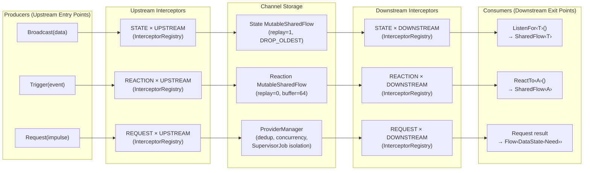
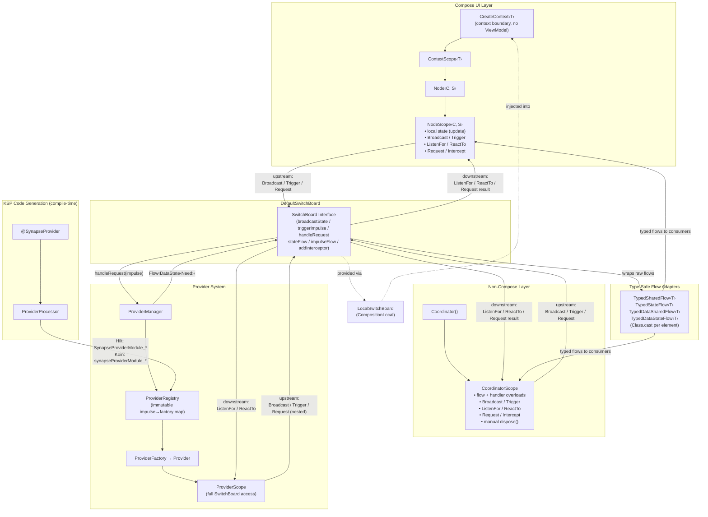
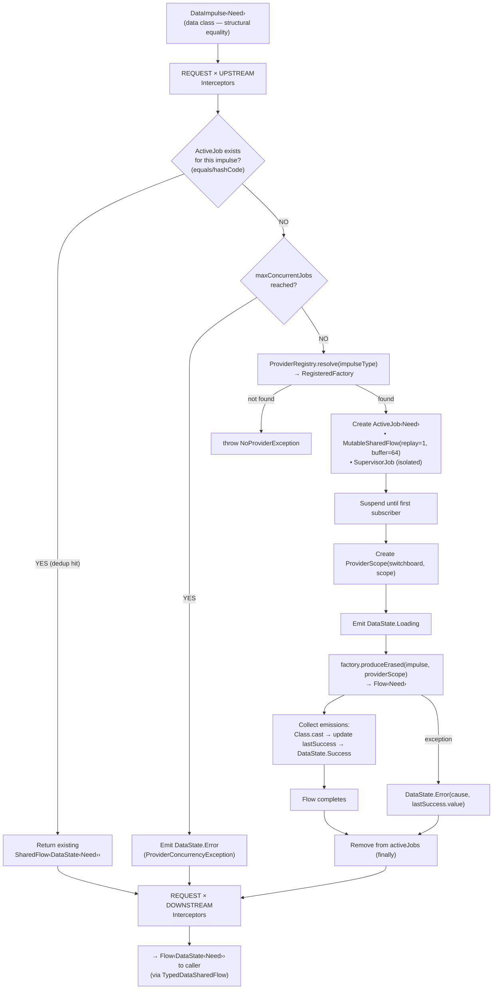
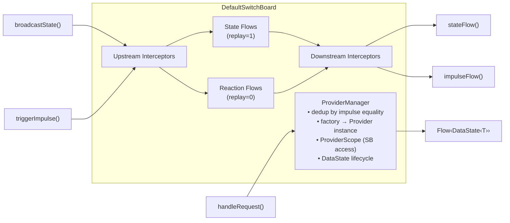
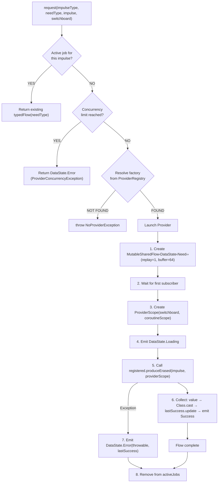
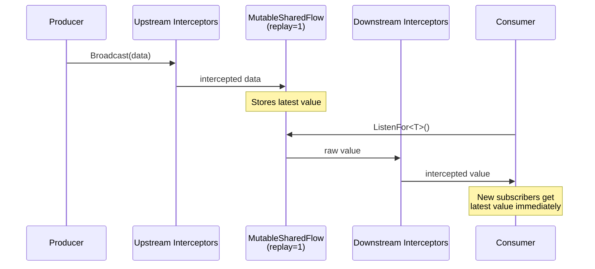
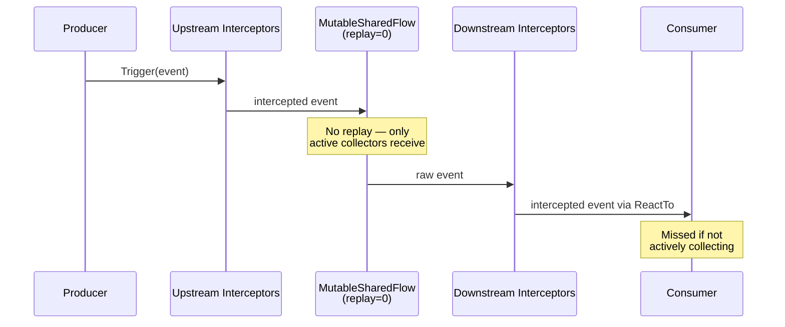
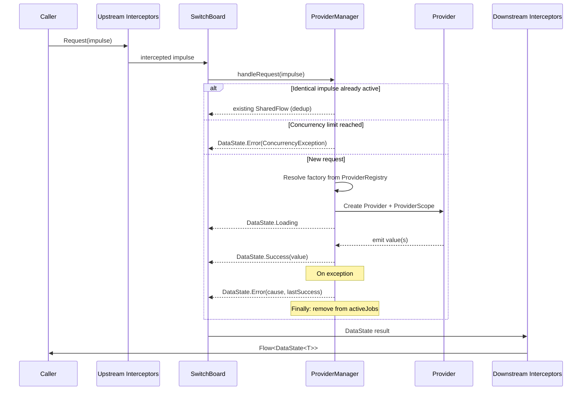

# Synapse Architecture Documentation

## Overview

**SynapseLib** is a reactive, event-driven architecture for Kotlin/Android applications built on Kotlin Coroutines `SharedFlow`. It provides a central message bus — the **SwitchBoard** — that coordinates three communication channels (**State**, **Reactions/Impulses**, and **Requests**) with a composable interceptor pipeline at every stage.

It integrates with both **Jetpack Compose** (via the `Node`/`CreateContext` DSL) and **non-Compose** contexts (via `Coordinator`), and uses **KSP code generation** to wire data-fetching **Providers** automatically through Hilt or Koin.

---

## Architecture Diagram

### Primary Data Flow (Upstream → Channel → Downstream)

This diagram shows how data moves through the three channels, with interceptors applied at each stage.



### Consumer & Producer Layers

This diagram shows which components can produce and consume, and how they connect to the SwitchBoard.



### Request Channel Detail (Provider Lifecycle)

This diagram zooms into the Request channel to show dedup, concurrency gating, and the DataState lifecycle.



---

## Component Reference

### Core Bus

#### `SwitchBoard` (interface)
**Package:** `com.synapselib.arch.base`

The central contract defining three communication channels (State, Reaction, Request), typed flow access, and interceptor registration. All cross-component communication flows through this interface.

**Key methods:**

| Method                                                | Purpose                                                                       |
|-------------------------------------------------------|-------------------------------------------------------------------------------|
| `broadcastState(clazz, data)`                         | Emits a value into the state channel (upstream interceptors applied)          |
| `triggerImpulse(clazz, data)`                         | Emits a fire-and-forget event into the reaction channel                       |
| `handleRequest(impulseType, needType, impulse)`       | Routes a data request to the Provider system, returns `Flow<DataState<Need>>` |
| `stateFlow(clazz)`                                    | Returns a downstream-intercepted `SharedFlow` for a state type (replay=1)     |
| `impulseFlow(clazz)`                                  | Returns a downstream-intercepted `SharedFlow` for a reaction type (replay=0)  |
| `getRawStateFlow(clazz)`                              | Returns the raw (unintercepted) state flow                                    |
| `getRawImpulseFlow(clazz)`                            | Returns the raw (unintercepted) reaction flow                                 |
| `addInterceptor(point, clazz, interceptor, priority)` | Registers an interceptor at a specific channel/direction point                |

Reified extension functions are provided for all methods so callers rarely need to pass `KClass` tokens manually:

```kotlin
// Instead of:
switchboard.broadcastState(UserProfile::class, profile)

// Write:
switchboard.broadcastState(profile)
```

A convenience `addLoggingInterceptors<T>` extension registers read-only interceptors at all 6 intercept points for a given type, with `Int.MIN_VALUE` priority upstream (runs first) and `Int.MAX_VALUE` downstream (runs last).

---

#### `DefaultSwitchBoard`
**Package:** `com.synapselib.arch.base`

The concrete `SwitchBoard` implementation. Injectable via Hilt (`@Inject constructor`).

**Internal architecture:**



**Backing data structures:**

| Store                    | Type                                                     | Purpose                                       |
|--------------------------|----------------------------------------------------------|-----------------------------------------------|
| `stateChannels`          | `ConcurrentHashMap<KClass, MutableSharedFlow<Any>>`      | Per-type state flows (replay=1)               |
| `reactionChannels`       | `ConcurrentHashMap<KClass, MutableSharedFlow<Any>>`      | Per-type reaction flows (replay=0, buffer=64) |
| `downstreamStateFlows`   | `ConcurrentHashMap<KClass, SharedFlow<Any>>`             | Cached downstream-intercepted state flows     |
| `downstreamImpulseFlows` | `ConcurrentHashMap<KClass, SharedFlow<Any>>`             | Cached downstream-intercepted impulse flows   |
| `interceptors`           | `ConcurrentHashMap<InterceptPoint, InterceptorRegistry>` | Per-point interceptor registries              |

**Constructor parameters:**

| Parameter                | Qualifier                      | Default          | Purpose                                                         |
|--------------------------|--------------------------------|------------------|-----------------------------------------------------------------|
| `scope`                  | `@SwitchBoardScope`            | —                | Parent `CoroutineScope` for `shareIn` and provider jobs         |
| `providerRegistry`       | —                              | —                | Immutable impulse→factory mappings                              |
| `workerContext`          | `@SwitchBoardWorkerContext`    | `Dispatchers.IO` | Coroutine context for provider execution                        |
| `stopTimeoutMillis`      | `@SwitchBoardStopTimeout`      | 3000ms           | `WhileSubscribed` stop timeout for downstream shared flows      |
| `replayExpirationMillis` | `@SwitchBoardReplayExpiration` | 3000ms           | `WhileSubscribed` replay expiration for downstream shared flows |

The `stopTimeoutMillis` and `replayExpirationMillis` parameters are used exclusively in the `shareIn(scope, SharingStarted.WhileSubscribed(...))` calls that create cached downstream flows. They control how long the shared flow stays active after the last subscriber disconnects and how long the replay cache is retained.

---

#### `LocalSwitchBoard`
**Package:** `com.synapselib.arch.base`

A Compose `CompositionLocal` that provides the current `SwitchBoard` to the composition tree. Throws `IllegalStateException` if accessed without a provider.

```kotlin
// Providing
CompositionLocalProvider(LocalSwitchBoard provides mySwitchBoard) {
    MyApp()
}

// Consuming (automatic via CreateContext)
val switchBoard = LocalSwitchBoard.current
```

---

### Three Channels

| Channel      | Replay            | Buffer          | Purpose                                                                                          | Produce            | Consume                     |
|--------------|-------------------|-----------------|--------------------------------------------------------------------------------------------------|--------------------|-----------------------------|
| **State**    | 1 (latest cached) | DROP_OLDEST     | Persistent state streams. New subscribers immediately get the last value.                        | `broadcastState()` | `stateFlow()` / `ListenFor` |
| **Reaction** | 0 (no replay)     | 64, DROP_OLDEST | Fire-and-forget events (toasts, navigation, analytics). Only active collectors receive them.     | `triggerImpulse()` | `impulseFlow()` / `ReactTo` |
| **Request**  | 1 (via provider)  | 64, DROP_OLDEST | Data-fetching requests routed to Providers. Returns `Flow<DataState<Need>>` with full lifecycle. | `handleRequest()`  | `Request`                   |

---

### Impulse Types

#### `Impulse`
**Package:** `com.synapselib.arch.base`

Base class for fire-and-forget reaction events. Subclass to define domain-specific events:

```kotlin
data class ShowToast(val message: String) : Impulse()
data class NavigateTo(val route: String) : Impulse()
object SessionExpired : Impulse()
```

Emitted via `Trigger()`, consumed via `ReactTo()`.

---

#### `DataImpulse<Need>`
**Package:** `com.synapselib.arch.base`

Base class for typed data requests. The generic `Need` parameter declares the expected result type, enforced at compile time.

```kotlin
data class FetchUserProfile(val userId: Int) : DataImpulse<UserProfile>()
data class SearchProducts(val query: String, val page: Int) : DataImpulse<ProductPage>()
```

**Critical:** Must be implemented as a `data class`. The provider system uses structural equality (`equals`/`hashCode`) for job deduplication — two `FetchUserProfile(42)` impulses share the same in-flight job, while `FetchUserProfile(42)` and `FetchUserProfile(99)` run concurrently. The KSP processor enforces this at compile time.

---

### DataState

#### `DataState<T>` (sealed interface)
**Package:** `com.synapselib.core.typed`

Represents the lifecycle of a data request:

| Variant                | Properties                          | When                                                                                                        |
|------------------------|-------------------------------------|-------------------------------------------------------------------------------------------------------------|
| `DataState.Idle`       | —                                   | Initial state before any request is made                                                                    |
| `DataState.Loading`    | —                                   | Request is in-flight                                                                                        |
| `DataState.Success<T>` | `data: T`                           | Request completed successfully                                                                              |
| `DataState.Error<T>`   | `cause: Throwable`, `staleData: T?` | Request failed. `staleData` holds the last successful value (if any) for stale-while-revalidate UI patterns |

**Extension properties:**

| Extension    | Returns   | Purpose                                   |
|--------------|-----------|-------------------------------------------|
| `dataOrNull` | `T?`      | Extracts `Success.data` or returns `null` |
| `isLoading`  | `Boolean` | `true` when in `Loading` state            |

---

### Type-Safe Flow Adapters

**Package:** `com.synapselib.core.typed`

These are lightweight, stateless adapters that narrow erased flows to typed flows using `Class.cast` on every element. They avoid unchecked generic casts and throw `ClassCastException` eagerly on type mismatches.

| Adapter                  | Narrows                                                 | Used By                                                              |
|--------------------------|---------------------------------------------------------|----------------------------------------------------------------------|
| `TypedSharedFlow<T>`     | `SharedFlow<Any>` → `SharedFlow<T>`                     | `DefaultSwitchBoard.stateFlow()`, `DefaultSwitchBoard.impulseFlow()` |
| `TypedStateFlow<T>`      | `StateFlow<Any>` → `StateFlow<T>`                       | Available for external use                                           |
| `TypedDataSharedFlow<T>` | `SharedFlow<DataState<*>>` → `SharedFlow<DataState<T>>` | `ProviderManager.ActiveJob.typedFlow()`                              |
| `TypedDataStateFlow<T>`  | `StateFlow<DataState<*>>` → `StateFlow<DataState<T>>`   | Available for external use                                           |

The `DataState`-aware adapters (`TypedDataSharedFlow`, `TypedDataStateFlow`) perform element-wise casting on the **inner** data values:
- `Idle` and `Loading` pass through unchanged (no data to cast).
- `Success` → `data` is cast via `Class.cast`.
- `Error` → `staleData` (if non-null) is cast via `Class.cast`.

All adapters are inexpensive to instantiate (no coroutines, no buffering) — the expensive `shareIn` work lives in the source flow.

---

### Interceptor System

#### `Interceptor<T>` (fun interface)
**Package:** `com.synapselib.arch.base`

A composable middleware unit (similar to OkHttp interceptors). Receives data and a `Chain` handle. Can:

- **Pass through**: call `chain.proceed(data)` unchanged (observation/logging).
- **Transform**: modify data before/after calling `chain.proceed`.
- **Short-circuit**: return a value without calling `chain.proceed`, skipping all downstream interceptors.

**Factory methods:**

| Factory                                          | Behavior                                          |
|--------------------------------------------------|---------------------------------------------------|
| `Interceptor.read { data -> ... }`               | Observe only — always proceeds with original data |
| `Interceptor.transform { data -> modifiedData }` | Maps data before proceeding                       |
| `Interceptor.full { data, proceed -> ... }`      | Full control: retry, skip, wrap, etc.             |

```kotlin
// Logging (read-only)
Interceptor.read<UserProfile> { profile ->
    logger.info("Profile loaded: ${profile.name}")
}

// Add auth token (transform)
Interceptor.transform<NetworkRequest> { request ->
    request.copy(token = authManager.currentToken)
}

// Retry on failure (full control)
Interceptor.full<ApiCall> { call, proceed ->
    try {
        proceed(call)
    } catch (e: Exception) {
        proceed(call.copy(retryCount = call.retryCount + 1))
    }
}
```

---

#### `Interceptor.Chain<T>` (fun interface)

Handle to invoke the next interceptor in the pipeline. The terminal handler is the identity function (`{ it }`).

---

#### `InterceptPoint`
**Package:** `com.synapselib.arch.base`

A coordinate of `(Channel, Direction)` identifying where an interceptor is installed. Six possible points:

| Point                    | Meaning                                                                 |
|--------------------------|-------------------------------------------------------------------------|
| `(STATE, UPSTREAM)`      | Before a state broadcast is emitted to the flow                         |
| `(STATE, DOWNSTREAM)`    | Before a collected state value is delivered to the listener             |
| `(REACTION, UPSTREAM)`   | Before a reaction event is emitted to the flow                          |
| `(REACTION, DOWNSTREAM)` | Before a collected reaction is delivered to the listener                |
| `(REQUEST, UPSTREAM)`    | Before request params reach the ProviderManager                         |
| `(REQUEST, DOWNSTREAM)`  | After the provider produces a result, before it's emitted to the caller |

---

#### `Direction` (enum)

| Value        | Meaning                                                 |
|--------------|---------------------------------------------------------|
| `UPSTREAM`   | Data flowing **into** the SwitchBoard (producer-side)   |
| `DOWNSTREAM` | Data flowing **out of** the SwitchBoard (consumer-side) |

---

#### `Channel` (enum)

| Value      | Meaning                                                    |
|------------|------------------------------------------------------------|
| `REQUEST`  | One-shot request/response interactions via ProviderManager |
| `STATE`    | Persistent, replay-1 state streams                         |
| `REACTION` | Fire-and-forget event streams with no replay               |

---

#### `InterceptorRegistry`
**Package:** `com.synapselib.arch.base`

Thread-safe, priority-ordered store of interceptors keyed by `KClass`.

**Ordering:** Interceptors execute in ascending priority order (lowest value first). Ties are broken by insertion order (FIFO).

**Internal structure:**
- `ConcurrentHashMap<KClass, ConcurrentSkipListSet<Entry>>` — primary storage.
- `ConcurrentHashMap<KClass, VersionedSnapshot>` — resolved cache with version-stamp invalidation.
- `AtomicLong` counters for insertion ordering and version tracking.

**Type resolution:** When applying interceptors for a type `T`, the registry finds all entries whose registered `KClass` is a supertype of `T` (via `Class.isAssignableFrom`), merges and sorts them, and caches the result. The cache is invalidated when the global version counter advances (on any add/remove).

**Chain construction:** Built iteratively from tail to head — each link is a lambda capturing the entry and the next chain reference. The terminal handler is the identity function.

---

#### `Registration` (fun interface)

Handle returned when registering an interceptor. Call `unregister()` to remove. Idempotent — later calls are safe no-ops. In-flight executions that already captured a chain snapshot are unaffected.

---

#### `InterceptorPipeline` (interface)

Minimal interface for applying interceptors to a value. `InterceptorRegistry` implements this. `DefaultSwitchBoard` uses an `EmptyPipeline` singleton (returns data unchanged) when no interceptors are registered for a given point.

---

### Provider System (Data Fetching)

#### `Provider<I, Need>` (abstract class)
**Package:** `com.synapselib.arch.base.provider`

The data-fetching backbone of SynapseLib. A cold-start data producer that handles a specific `DataImpulse` type.

**Lifecycle:** Providers are factory-instantiated — they don't exist until a matching `DataImpulse` arrives. The `ProviderManager` creates them on demand, collects their output, wraps it in `DataState`, and disposes them when work is complete.

**Single abstract method:**

```kotlin
abstract fun ProviderScope.produce(impulse: I): Flow<Need>
```

**Usage patterns:**

```kotlin
// One-shot fetch
@SynapseProvider
class FetchUserProfileProvider @Inject constructor(
    private val api: UserApi,
) : Provider<FetchUserProfile, UserProfile>() {
    override fun ProviderScope.produce(impulse: FetchUserProfile) = flow {
        emit(api.getProfile(impulse.userId))
    }
}

// Streaming / observation
@SynapseProvider
class WatchCartProvider @Inject constructor(
    private val cartDao: CartDao,
) : Provider<WatchCart, Cart>() {
    override fun ProviderScope.produce(impulse: WatchCart): Flow<Cart> =
        cartDao.observeCart(impulse.cartId)
}

// Provider that uses SwitchBoard capabilities
@SynapseProvider
class FetchAuthenticatedDataProvider @Inject constructor(
    private val api: SecureApi,
) : Provider<FetchSecureData, SecurePayload>() {
    override fun ProviderScope.produce(impulse: FetchSecureData) = flow {
        val token = ListenFor<AuthToken>().first()
        emit(api.fetch(impulse.endpoint, token))
    }
}
```

---

#### `ProviderScope`
**Package:** `com.synapselib.arch.base.provider`

A lightweight, scoped context given to Providers during execution. Implements `CoroutineScope` by delegation, so `launch`, `async`, etc. are available inside `produce`.

**Capabilities:**

| Method                      | Purpose                                                        |
|-----------------------------|----------------------------------------------------------------|
| `ListenFor<O>()`            | Returns `SharedFlow<O>` from the state channel                 |
| `ReactTo<A>()`              | Returns `SharedFlow<A>` from the reaction channel              |
| `Broadcast(data)`           | Emits state into the SwitchBoard                               |
| `Trigger(event)`            | Fires a reaction impulse                                       |
| `Request<Need, I>(impulse)` | Issues a nested data request (returns `Flow<DataState<Need>>`) |

The lifecycle is framework-managed — the `ProviderManager` creates and destroys the scope based on subscriber demand.

---

#### `ProviderFactory<I, Need>` (fun interface)

Factory that creates `Provider` instances on demand (cold-start). The `ProviderManager` holds these and invokes them when a matching `DataImpulse` arrives.

```kotlin
fun interface ProviderFactory<I : DataImpulse<Need>, Need : Any> {
    fun create(): Provider<I, Need>
}
```

In DI-managed projects, KSP generates the factory registrations automatically from `@SynapseProvider`-annotated classes.

---

#### `ProviderRegistry`
**Package:** `com.synapselib.arch.base.provider`

Immutable (after construction) map of `KClass<DataImpulse>` → `RegisteredFactory`. The **only** place where impulse→provider relationships are declared.

**Construction via Builder:**

```kotlin
val registry = ProviderRegistry.Builder()
    .register<UserProfile, FetchUserProfile> {
        FetchUserProfileProvider(api)
    }
    .register<ProductPage, SearchProducts> {
        SearchProductsProvider(api)
    }
    .build()
```

**Multi-module composition:**

```kotlin
val registry = ProviderRegistry.Builder()
    .mergeFrom(featureARegistry)
    .mergeFrom(featureBRegistry)
    .build()
```

**Query methods:**

| Method                     | Purpose                                               |
|----------------------------|-------------------------------------------------------|
| `hasProvider(impulseType)` | Returns `true` if a provider is registered            |
| `registeredImpulseTypes()` | Returns the set of all registered `DataImpulse` types |
| `size`                     | Total number of registered providers                  |

**`ProviderRegistry.EMPTY`** — an empty registry for use in tests.

---

#### `ProviderRegistry.RegisteredFactory<I, Need>` (internal)

Type-safe wrapper pairing `Class` tokens with a `ProviderFactory`. Encapsulates all type-erased operations so callers never interact with erased generics directly.

| Method                                             | Purpose                                                                         |
|----------------------------------------------------|---------------------------------------------------------------------------------|
| `castImpulse(impulse: Any): I`                     | Checked cast via `Class.cast`                                                   |
| `createProvider(): Provider<I, Need>`              | Delegates to the factory                                                        |
| `produceErased(impulse, providerScope): Flow<Any>` | Creates provider, casts impulse, invokes `produce`, returns widened `Flow<Any>` |

---

#### `ProviderManager`
**Package:** `com.synapselib.arch.base.provider`

**Internal** runtime engine (not public API). The `SwitchBoard` delegates to it. Manages:

1. **Job deduplication**: Active jobs are keyed by `DataImpulse` instance (structural equality). Identical impulses share the same `SharedFlow<DataState>`.
2. **Concurrency limiting**: Configurable `maxConcurrentJobs` (0 = unbounded). Excess requests receive `DataState.Error(ProviderConcurrencyException)`.
3. **Isolation**: Each job runs under a `SupervisorJob`, so one provider's failure doesn't cancel others.
4. **DataState lifecycle**: Automatically emits `Loading` → `Success`/`Error`. Tracks `lastSuccess` for stale-data support.
5. **Cleanup**: Completed jobs are removed from the active table in a `finally` block.

**Request flow:**



---

#### `ActiveJob<Need>` (internal to ProviderManager)

Bundles the shared `DataState` flow with its coroutine `Job` and the `Class` token for checked casts.

| Property                                  | Purpose                                                        |
|-------------------------------------------|----------------------------------------------------------------|
| `needClass: Class<Need>`                  | Type token for runtime verification                            |
| `sharedFlow: SharedFlow<DataState<Need>>` | The flow driving DataState transitions                         |
| `job: Job`                                | The coroutine backing this provider execution                  |
| `lastSuccess: MutableStateFlow<Need?>`    | Tracks the most recent successful value for stale-data support |

The `typedFlow(expectedClass)` method returns a `TypedDataSharedFlow` that performs checked element-wise casting — no unchecked casts anywhere in the chain.

---

#### Exceptions

| Exception                      | When                                                                                                                  |
|--------------------------------|-----------------------------------------------------------------------------------------------------------------------|
| `NoProviderException`          | A `DataImpulse` is dispatched but no `ProviderFactory` is registered. Should never occur with KSP validation enabled. |
| `ProviderConcurrencyException` | The `ProviderManager`'s `maxConcurrentJobs` limit has been reached. Returned as `DataState.Error`.                    |

---

### Compose DSL

#### `CreateContext<T>`
**Package:** `com.synapselib.arch.base`

Top-level composable that establishes a **context boundary**. Pairs an arbitrary context value (a shared domain object, configuration, or service locator) with the nearest `SwitchBoard` from `LocalSwitchBoard`. Synapse replaces MVVM entirely — there are no ViewModels in a correctly configured Synapse application.

```kotlin
@Composable
fun MyFeature(appServices: AppServices) {
    CreateContext(appServices) {
        // `this` is ContextScope<AppServices>
        Node(initialState = UiState()) {
            // `this` is NodeScope<AppServices, UiState>
        }
    }
}
```

The `ContextScope` is `remember`ed by `context` and `switchboard`, so it's recreated only when either identity changes.

---

#### `ContextScope<T>`
**Package:** `com.synapselib.arch.base`

Holds the shared context value and `SwitchBoard` reference. Provides suspending `Trigger` and `Broadcast` functions for use from coroutines.

---

#### `Node<C, S>`
**Package:** `com.synapselib.arch.base`

Composable that creates a **stateful node** inside a `ContextScope`. The fundamental unit of the Compose DSL.

**Features:**
- **Local state** of type `S`, managed via `NodeScope.update`.
- **Automatic state persistence**: If `S` has a `KSerializer` (kotlinx.serialization), state is saved/restored via `rememberSaveable`. Otherwise, falls back to `remember`.
- **Lifecycle-aware disposal**: Interceptors registered via `Intercept` are automatically unregistered when the node leaves the composition.

---

#### `NodeScope<C, S>`
**Package:** `com.synapselib.arch.base`

The primary DSL receiver inside a `Node`.

**Capabilities:**

| Category              | Methods                                   | Composable?                |
|-----------------------|-------------------------------------------|----------------------------|
| **Local state**       | `update { reducer }`                      | No — call from callbacks   |
| **State broadcast**   | `Broadcast(data)`                         | No — suspending            |
| **Reactions**         | `Trigger(event)`                          | No — suspending            |
| **Interception**      | `Intercept(point, interceptor, priority)` | No — registers immediately |
| **Request**           | `Request(impulse, key) { callback }`      | Yes — lifecycle-aware      |
| **Listen (state)**    | `ListenFor(stateKey) { handler }`         | Yes — lifecycle-aware      |
| **Listen (reaction)** | `ReactTo(reactionKey) { handler }`        | Yes — lifecycle-aware      |

**Properties:**

| Property  | Type             | Purpose                                                            |
|-----------|------------------|--------------------------------------------------------------------|
| `context` | `C`              | Read-only access to the value from `CreateContext`                 |
| `state`   | `S`              | Current snapshot of local state (triggers recomposition on change) |
| `scope`   | `CoroutineScope` | For launching coroutines from callbacks                            |

**Lifecycle-aware subscriptions** (`ListenFor`, `ReactTo`, `Request`) use `DisposableEffect` internally — they're canceled and relaunched when their key changes, and canceled when the composable leaves the composition. Handlers are wrapped with `rememberUpdatedState` so the latest lambda is always called.

```kotlin
Node(initialState = ScreenState()) {
    // Read state
    Text("Count: ${state.count}")

    // Update state
    Button(onClick = { update { it.copy(count = it.count + 1) } }) {
        Text("Increment")
    }

    // Listen for external state
    ListenFor<ThemeSettings> { settings ->
        update { it.copy(darkMode = settings.darkMode) }
    }

    // React to events
    ReactTo<NavigateTo> { event ->
        navController.navigate(event.route)
    }

    // Data request
    Request<UserProfile, FetchUserProfile>(
        impulse = FetchUserProfile(userId = 42),
    ) { dataState ->
        update { it.copy(profileState = dataState) }
    }

    // Intercept outgoing requests
    Intercept<NetworkRequest>(
        point = InterceptPoint(Channel.REQUEST, Direction.UPSTREAM),
        interceptor = Interceptor.transform { req -> req.copy(token = authToken) },
    )
}
```

---

#### `rememberState<S>`
**Package:** `com.synapselib.arch.base`

Internal helper used by `Node`. Attempts to find a `KSerializer<S>` via `serializer<S>()`. If found, uses `rememberSaveable` with a JSON-based `Saver` for state persistence across configuration changes. If no serializer is available, falls back to `remember { mutableStateOf(initialState) }`.

---

### Non-Compose Layer (Coordinator)

#### `Coordinator()`
**Package:** `com.synapselib.arch.base`

Factory function that creates a `CoordinatorScope` and runs an initialization block. The primary entry point for wiring SwitchBoard communication outside Compose — typically from activities, services, or background processes.

```kotlin
val coordinator = Coordinator(switchboard, lifecycleScope) {
    // Wire up listeners
    ListenFor<AppConfig> { config ->
        applyConfig(config)
    }

    ReactTo<SessionExpired> {
        launch { Trigger(NavigateToLogin) }
    }

    // Register interceptors
    Intercept<AnalyticsEvent>(
        point = InterceptPoint(Channel.REACTION, Direction.UPSTREAM),
        interceptor = Interceptor.read { event -> analytics.track(event) },
    )
}

// Later, when done:
coordinator.dispose()
```

---

#### `CoordinatorScope`
**Package:** `com.synapselib.arch.base`

Long-lived, manually managed counterpart to `NodeScope`. Implements `CoroutineScope` by delegation.

**Two overload styles for every consumption method:**

| Category              | Flow overload (returns flow)                          | Handler overload (launch + collect)                        |
|-----------------------|-------------------------------------------------------|------------------------------------------------------------|
| **State broadcast**   | —                                                     | `Broadcast(data)` (suspending)                             |
| **Reactions**         | —                                                     | `Trigger(event)` (suspending)                              |
| **Interception**      | —                                                     | `Intercept(point, interceptor, priority)` → `Registration` |
| **Listen (state)**    | `ListenFor<O>()` → `SharedFlow<O>`                    | `ListenFor<O> { handler }` → `Job`                         |
| **Listen (reaction)** | `ReactTo<A>()` → `SharedFlow<A>`                      | `ReactTo<A> { handler }` → `Job`                           |
| **Request**           | `Request<Need, I>(impulse)` → `Flow<DataState<Need>>` | `Request<Need, I>(impulse) { callback }` → `Job`           |

Flow overloads are useful for composition, filtering, debouncing, or other transformations before collecting:

```kotlin
val coordinator = Coordinator(switchboard) {
    val configFlow = ListenFor<AppConfig>()
    val flagsFlow = ListenFor<FeatureFlags>()

    launch {
        combine(configFlow, flagsFlow) { config, flags ->
            resolveSettings(config, flags)
        }.collectLatest { settings ->
            Broadcast(settings)
        }
    }
}
```

Handler overloads run with `CoordinatorScope` as the receiver, giving direct access to `Broadcast`, `Trigger`, `launch`, etc.

**Lifecycle — `dispose()`:**
1. Cancels the backing coroutine job and all children.
2. Unregisters all interceptors added via `Intercept`.
3. Clears the internal registration list.

Idempotent — calling multiple times is safe.

---

### KSP Code Generation

#### `@SynapseProvider` (annotation)
**Package:** `com.synapselib.arch.base.provider`

Source-retention annotation marking a concrete `Provider` subclass for compile-time validation and automatic `ProviderRegistry` wiring.

**Requirements for annotated classes:**
1. Must be a **concrete** (non-abstract) class.
2. Must directly extend `Provider<I, Need>` with concrete type arguments.
3. Should have an `@Inject` constructor (for Hilt) or be resolvable by Koin.
4. The `DataImpulse` type argument (`I`) must be a `data class`.

---

#### `ProviderProcessor`
**Package:** `com.synapselib.arch.base.provider`

KSP `SymbolProcessor` that processes `@SynapseProvider` annotations.

**Processing pipeline:**

```
Phase 1: Validate & Extract
    ├─ Must be a class (not interface/object/enum)
    ├─ Must not be abstract
    ├─ Must extend Provider<I, Need>
    ├─ Type arguments must be concrete (no star projections)
    ├─ DataImpulse must be a data class
    └─ Warn if no @Inject constructor

Phase 2: Detect Duplicates
    └─ No two @SynapseProvider classes may handle the same DataImpulse type

Phase 3: Generate Code
    ├─ If Hilt on classpath → generate Hilt @Module
    ├─ If Koin on classpath → generate Koin module
    └─ If neither → compile error
```

**Compile-time errors reported for:**
- `@SynapseProvider` on a non-class declaration
- `@SynapseProvider` on an abstract class
- Class doesn't extend `Provider`
- Unresolvable type arguments / star projections
- Duplicate providers for the same `DataImpulse` type
- No supported DI framework found

**Compile-time warning for:**
- No `@Inject` constructor (Hilt won't be able to provide dependencies)

---

#### `ProviderProcessorProvider`
**Package:** `com.synapselib.arch.base.provider`

KSP entry point discovered via `@AutoService`. Reads the `synapse.moduleName` KSP option (defaults to `"App"`), sanitizes it (e.g., `"feature-login"` → `"FeatureLogin"`), and creates the `ProviderProcessor`.

---

#### Generated Hilt Module

For each Gradle module, generates `SynapseProviderModule_{ModuleName}`:

```kotlin
@Module
@InstallIn(SingletonComponent::class)
object SynapseProviderModule_App {

    @Provides
    @Singleton
    fun provideRegistry(
        fetchUserProfileProvider: javax.inject.Provider<FetchUserProfileProvider>,
        searchProductsProvider: javax.inject.Provider<SearchProductsProvider>,
    ): ProviderRegistry {
        return ProviderRegistry.Builder()
            .register(
                impulseType = FetchUserProfile::class,
                needClass = UserProfile::class.java,
                factory = ProviderFactory { fetchUserProfileProvider.get() },
            )
            .register(
                impulseType = SearchProducts::class,
                needClass = ProductPage::class.java,
                factory = ProviderFactory { searchProductsProvider.get() },
            )
            .build()
    }
}
```

Uses `javax.inject.Provider<T>` for lazy cold-start factories — each `.get()` call creates a new instance.

For parameterized `Need` types (e.g., `List<UserProfile>`), the generated code includes `@Suppress("UNCHECKED_CAST")` with a JVM erasure cast on the `Class` token — this is safe and standard.

**Testing override:**

```kotlin
@UninstallModules(SynapseProviderModule_App::class)
@HiltAndroidTest
class MyTest {
    @BindValue
    val registry = ProviderRegistry.Builder()
        .register<UserProfile, FetchUserProfile> { FakeProvider() }
        .build()
}
```

---

#### Generated Koin Module

For each Gradle module, generates `synapseProviderModule_{ModuleName}`:

```kotlin
val synapseProviderModule_app = module {

    factory { get<FetchUserProfileProvider>() }
    factory { get<SearchProductsProvider>() }

    single<ProviderRegistry> {
        ProviderRegistry.Builder()
            .register(
                impulseType = FetchUserProfile::class,
                needClass = UserProfile::class.java,
                factory = ProviderFactory { get<FetchUserProfileProvider>() },
            )
            .register(
                impulseType = SearchProducts::class,
                needClass = ProductPage::class.java,
                factory = ProviderFactory { get<SearchProductsProvider>() },
            )
            .build()
    }
}
```

The generated code assumes Koin can resolve each provider class via constructor injection (Koin's built-in resolution). Users must ensure their provider classes are declared in a Koin module or are resolvable through Koin's standard mechanisms.

**Usage:**

```kotlin
startKoin {
    modules(synapseProviderModule_app)
}
```

**Testing override:**

```kotlin
loadKoinModules(module {
    single<ProviderRegistry> {
        ProviderRegistry.Builder()
            .register<UserProfile, FetchUserProfile> { FakeProvider() }
            .build()
    }
})
```

---

## Data Flow Summary

### State Broadcast & Consumption



### Reaction (Impulse) Flow



### Request Flow

